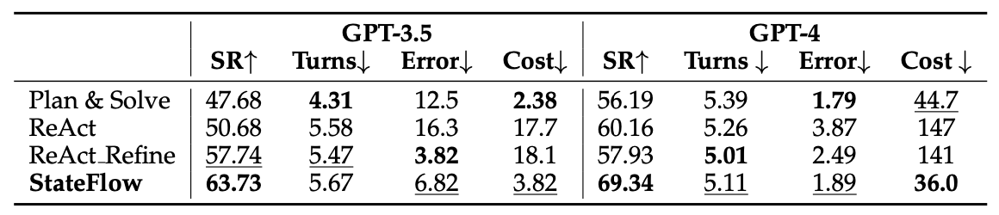
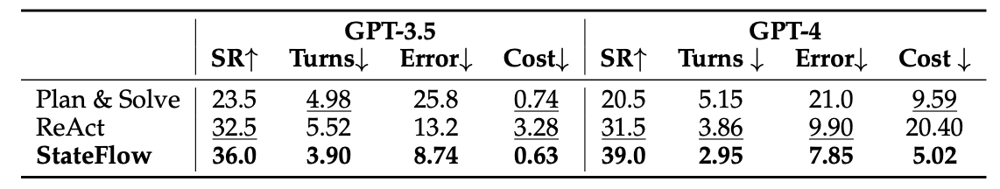
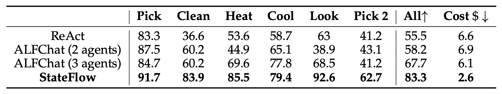
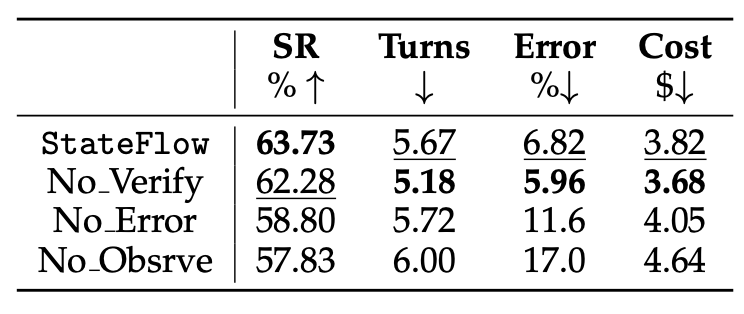
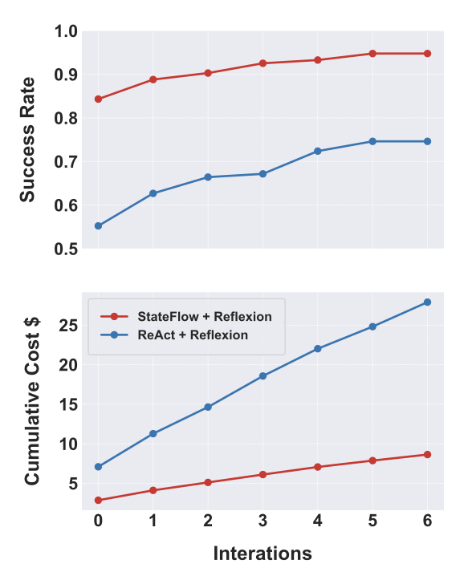

# StateFlow: Enhancing LLM Task-Solving through State-Driven Workflows


This repository is the implementation of COLM 2024 submission **StateFlow: Enhancing LLM Task-Solving through State-Driven Workflows**. This implementation is based on an open-source LLM framework AutoGen. This version of the code is made to facilitate the peer review of the COLM 2024 submission, and will be removed after. We plan to release the code accompanying the formal publication of the paper.


## Datasets

- [InterCode](https://github.com/princeton-nlp/intercode): InterCode is designed as an interactive code environments to evaluate language agents that can code. From it, we evaluate StateFlow on two datasets:
    - (1) SQL: The InterCode-SQL adapts the Spider dataset for MySQL, containing 1034 task instances. For each task, a MySQL interpreter is set up with all relevant tables within a docker container. 
    - (2) Bash: The InterCode-Bash dataset has 200 task instances curated from the NL2Bash dataset.

- [ALFWorld](https://github.com/alfworld/alfworld): ALFWorld contains interactive TextWorld environments that parallel embodied worlds in the ALFRED dataset. The aligned environments allow agents to reason and learn high-level policies in an abstract space before solving embodied tasks through low-level actuation.


## Experiments
We recommend create separate environments for InterCode and ALFWorld.

Both benchmarks require the installation of AutoGen:
```bash
pip install pyautogen
```

Then, create a "OAI_CONFIG_LIST" file and add your key, this will be used to access the LLM models:
```
[
    {
        "model": "gpt-35-turbo-1106",
        "api_key": "Your openai key here",
    },
    {
         "model": "gpt-35-turbo-1106",
         "api_key": "Your azure key",
         "api_type": "azure",
         "base_url": "Your base url here",
         "api_version": "Your api version here",
    }
]
```

When running the experiments, make sure to change the path to the `OAI_CONFIG_LIST` file in corresponding python files (e.g., `ALFWorld/stateflow.py`, `InterCode/flow_bash.py`, `InterCode/flow_sql.py`):
```python
config_list = autogen.config_list_from_json(
    "Your path to OAI_CONFIG_LIST file here",
    filter_dict={"model": model},
)
```

### Run InterCode
1. Please follow the instructions in the [InterCode](https://github.com/princeton-nlp/intercode) repository to download intercode. Use the build from source instructions:
    ```bash
    git clone https://github.com/princeton-nlp/intercode.git
    cd intercode
    conda env create -f environment.yml
    conda activate intercode
    ```
2. After you are in `intercode` folder, copy files from `InterCode` folder to `intercode` folder:
    ```bash
    bash ../InterCode/copy_files.sh
    ```
    We did some modifications to the `setup.sh` and the docker files: 
    - Change sql dockerfile path to `ic_spider_dbs.sql`.
    - Create 4 different docker images for the 4 different bash tasks.

3. Run `setup.sh` to create the docker images for the InterCode Bash and SQL environments.
    ```bash
    bash setup.sh
    ```

4. Run StateFlow for InterCode SQL:
    ```bash
    bash scripts/stateflow.sh
    ```


### Run ALFWorld

1. Please follow the instructions in the [ALFWorld](https://github.com/alfworld/alfworld) repository to install the ALFWorld environment. 
2. Change the relevant path in `stateflow.py`:
    ```python
    os.environ["ALFWORLD_DATA"] = "Your path to ALFWorld data here."
    ```

3. Run stateflow for ALFWorld:
    ```bash
    python stateflow.py
    ```


## Results

Results on InterCode SQL:

<!--  -->


Results on InterCode Bash:

<!--  -->


Results on ALFWorld:

<!--  -->


Ablation of states on the InterCode SQL dataset with GPT-3.5-Turbo:



StateFlow + Reflexion on ALFWorld (with 6 iterations):


<!--  -->


